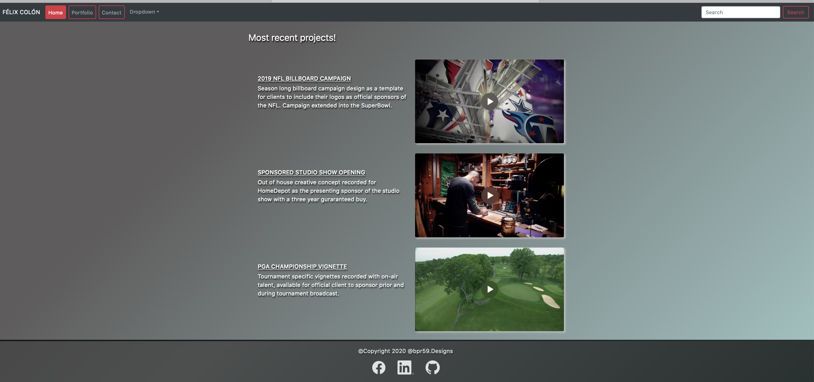

BOOTSTRAP ABOUT-ME HOMEWORK

CLIENT GOAL

For this project the we are the client and we need to develop a "about me" website.

ASSIGNMENT GOAL

To create a presentation website of myself or fictional character demonstrating the use of Bootstrap elements such as:
    grid system
    components
    layout
    responsiveness

Page should also include a consistent navbar with working links to other html files in the project.
As an extra challenge we needed to add a sticky footer.
Also, we needed to manage the development of the webpage with clear and consistent commits that explained the design process.

INDEX.HTML

1- File has a jumbotron at the top of the page with a company name and statement.

2- A fully functional navbar includes active links for home/portfolio/contact/dropdown buttons and pulldown. Also, the personal name is active as with a home-link. 

3- The dropdown menu has two active links that open separate links to a resume and hobbies page.

4- The search input box is active.

5- The main section of the file has a card with a picture and titles of the page personality.

6- Two paragraphs are formated inside a row/column container to the right of the card.

7- First paragraph has a career statement.

8- Second paragraph has loremipsum text.

9- A fully fuctional sticky footer closes the page and includes links to LinkedIn and GitHub accounts.

PORTFOLIO.HTML

1- A fully functional navbar includes active links for home/portfolio/contact/dropdown buttons and pulldown. Also, the personal name is active as with a home-link. 

2- A single row element works as a title graphic for the content of the page.

3- A center section with the principal project I want to present in this file takes over half the page with a video clip and an external link is active in the title graphic of the clip.

4- A second section with two columns follows with two describing paragraphs and two active video links with full playback controls. These clips also have external links active in the title graphics of each clip.

5- A fully fuctional sticky footer closes the page and includes links to LinkedIn and GitHub accounts.

CONTACT.HTML

1- A fully functional navbar includes active links for home/portfolio/contact/dropdown buttons and pulldown. Also, the personal name is active as with a home-link. 

2- A single row element works as a title graphic for the content of the page.

3- Main section of the file has a request form for visitors to join a mailing list or to contact the designer.

4- A fully fuctional sticky footer closes the page and includes links to LinkedIn and GitHub accounts.

STYLE.CSS

1- File has the values for the sticky footer to deploy correctly.
